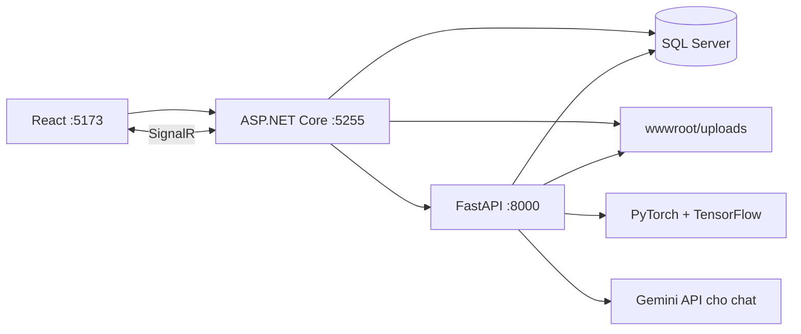

# Medical System with X-Ray AI

Đồ án xây dựng hệ thống quản lý khám bệnh và tích hợp phân tích ảnh X-quang phổi, với ba vai trò: **bệnh nhân, bác sĩ và quản trị viên**.

Ứng dụng kết hợp React, ASP.NET Core, SQL Server và một dịch vụ AI viết bằng Python. Bệnh nhân tải ảnh lên; dịch vụ AI lọc ảnh đầu vào, phân loại và tạo vùng trực quan hóa; bác sĩ xem kết quả để ghi nhận chẩn đoán trên hệ thống.

> Dự án phục vụ học tập và trình diễn phần mềm. Kết quả mô hình và phản hồi chatbot chưa được xác nhận cho sử dụng lâm sàng, không thay thế đánh giá của bác sĩ.

## Chức năng

| Vai trò | Chức năng chính |
| --- | --- |
| Bệnh nhân | Đăng ký, đăng nhập; tải và theo dõi ảnh X-quang; đặt lịch khám; nhắn tin; xem thông báo |
| Bác sĩ | Xem ca được phân công và kết quả AI; ghi nhận chẩn đoán; quản lý lịch khám; nhắn tin |
| Quản trị viên | Quản lý người dùng; phân công ảnh tự động hoặc thủ công; quản lý lịch khám |

Các thành phần chung gồm xác thực JWT, làm mới token, phân quyền và chat thời gian thực qua SignalR. Dịch vụ Python cũng có endpoint tạo phản hồi chat qua Gemini API.

## Công nghệ

| Thành phần | Công nghệ trong mã nguồn |
| --- | --- |
| Giao diện | React 19, Vite 8, Tailwind CSS 3, Zustand, Axios, Recharts |
| API | ASP.NET Core / .NET 10, Entity Framework Core 10, JWT, SignalR |
| Dữ liệu | SQL Server; Python truy cập qua pyodbc |
| Dịch vụ AI | FastAPI, TensorFlow/Keras, PyTorch/torchvision, OpenCV |

## Kiến trúc



API và AI Service dùng chung database và thư mục ảnh. Cấu hình hiện tại phục vụ chạy local trên Windows.

```text
MedicalDiagnosis.API/             API, phân quyền, SignalR và dịch vụ nghiệp vụ
MedicalDiagnosis.Core/            Entity và DTO
MedicalDiagnosis.Infrastructure/  DbContext và EF Core migrations
meddiag-frontend/                 Giao diện React
AI_Service/                      FastAPI, lọc ảnh và suy luận mô hình
Database/                        Script kiểm tra và tối ưu SQL
docs/                            Hướng dẫn cài đặt
```

## Chạy trên máy cá nhân

Xem **[hướng dẫn cài đặt](docs/SETUP.md)** để cấu hình SQL Server, JWT, trọng số mô hình và khởi chạy ba dịch vụ.

| Dịch vụ | Địa chỉ local |
| --- | --- |
| Giao diện | http://localhost:5173 |
| API / Swagger (Development) | http://localhost:5255/swagger |
| FastAPI docs | http://localhost:8000/docs |

## Luồng xử lý ảnh

1. Bệnh nhân tải ảnh lên API.
2. Dịch vụ AI đọc thông tin ảnh trong SQL Server và nội dung ảnh từ thư mục dùng chung.
3. Bộ lọc ResNet18 kiểm tra ảnh đầu vào trước khi phân loại.
4. Mô hình TensorFlow phân loại thành bình thường, viêm phổi do vi khuẩn hoặc viêm phổi do virus theo các nhãn khai báo trong code.
5. Grad-CAM tạo heatmap; các bounding box được suy ra từ heatmap. Đây không phải mô hình phát hiện tổn thương được đánh giá độc lập.
6. Kết quả được lưu để giao diện và bác sĩ tra cứu.

## Giới hạn hiện tại

- Một số URL, tên SQL Server và đường dẫn thư mục đang khai báo trực tiếp trong code; cần điều chỉnh khi chuyển máy.
- Trọng số mô hình phải được chuẩn bị riêng nếu bản clone không có. Hướng dẫn cài đặt nêu đúng tên file mà code sử dụng.
- Tài liệu hiện chưa có nguồn dữ liệu huấn luyện, quy trình đánh giá hoặc chỉ số kiểm thử mô hình có thể tái lập; không công bố độ chính xác khi chưa có bằng chứng.
- Endpoint kiểm tra trạng thái AI chỉ xác nhận tiến trình phản hồi, không bảo đảm mô hình đã tải thành công.
- Hướng dẫn chạy được đối chiếu với mã nguồn; chưa xác minh toàn bộ quá trình cài đặt trên máy sạch.


